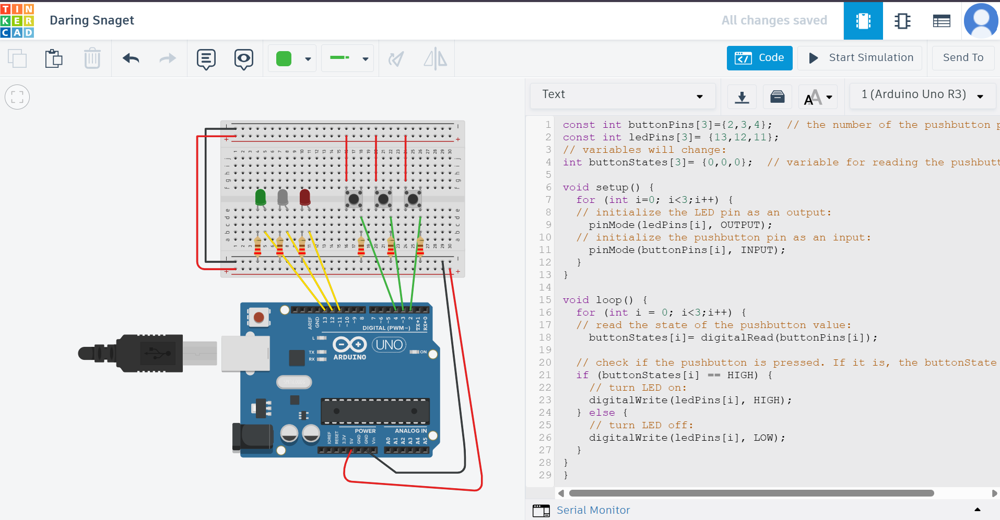

# Arduino Project: 3 Buttons Control 3 LEDs

This is a simple project using Arduino and Tinkercad It controls 3 LED lights using 3 buttons Each button controls one LED

## Components Used
- Arduino Uno board  
- 3 LED lights  
- 3 buttons  
- 3 resistors (220Ω)  
- Breadboard  
- Jumper wires

## Project Idea
Each button is connected to a specific LED:
- Button 1 → turns on LED 1  
- Button 2 → turns on LED 2  
- Button 3 → turns on LED 3  

When the button is pressed the corresponding LED turns on When released the LED turns off

## Code
The code is written in Arduino  
You can find it in the file: [`3buttons-3leds-code.ino`](./3buttons-3leds-code.ino)

## Project Image

## Platform Used
The project was built and tested on [Tinkercad Circuits](https://www.tinkercad.com/)
